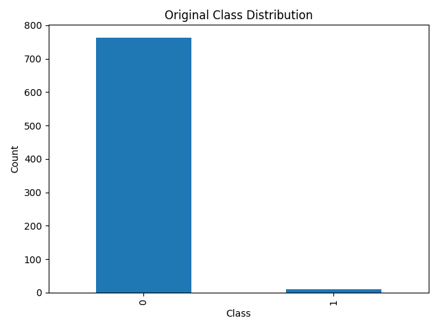
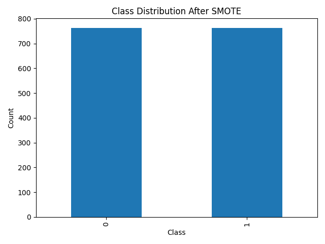

# Sampling Assignment – Credit Card Fraud Detection

## Objective

The objective of this assignment is to understand the importance of **sampling techniques** in handling **highly imbalanced datasets** and to analyze how different sampling strategies affect the performance of various **machine learning models**.

In real-world applications such as credit card fraud detection, class imbalance can significantly bias model predictions. This project demonstrates how proper sampling improves model accuracy and reliability.

---

## Project Structure

SAMPLING_ASSIGNMENT_102303750/
│
├── data/
│ └── Creditcard_data.csv
│
├── src/
│ ├── sampling.py
│ ├── models.py
│ └── main.py
│
├── results/
│ ├── accuracy_table.csv
│ ├── accuracy_heatmap.png
│ ├── original_class_distribution.png
│ └── smote_class_distribution.png
│
├── requirements.txt
└── README.md


---

## Dataset Description

- **Dataset:** Credit Card Fraud Dataset  
- **Target Column:** `Class`
  - `0` → Normal Transaction  
  - `1` → Fraudulent Transaction  

The dataset is **highly imbalanced**, making it unsuitable for direct model training without sampling.

---

## Sampling Techniques Used

The following sampling techniques were applied using the `imbalanced-learn` library:

| Sampling Code | Technique |
|--------------|----------|
| Sampling1 | Random Under Sampling |
| Sampling2 | Random Over Sampling |
| Sampling3 | SMOTE |
| Sampling4 | NearMiss |
| Sampling5 | SMOTEENN |

Each technique produces a balanced dataset used for model training.

---

## Machine Learning Models Used

| Model Code | Model |
|----------|------|
| M1 | Logistic Regression |
| M2 | Decision Tree |
| M3 | Random Forest |
| M4 | K-Nearest Neighbors (KNN) |
| M5 | Naive Bayes |

---

## Visualization Results

All visualizations are automatically generated and saved in the `results/` directory.  
They are displayed below for easy interpretation.

---

### 📊 Original Class Distribution (Before Sampling)

This chart shows the severe imbalance in the original dataset.



---

### 📊 Class Distribution After SMOTE Sampling

This chart confirms that SMOTE successfully balances the dataset by generating synthetic minority samples.



---

### 📊 Accuracy Comparison Heatmap

This heatmap compares model accuracy across all sampling techniques.


---

## Accuracy Results Table

The complete accuracy results are stored in:

results/accuracy_table.csv


A summarized view of the results is shown below:

| Model | Sampling1 | Sampling2 | Sampling3 | Sampling4 | Sampling5 |
|------|----------|----------|----------|----------|----------|
| M1 (Logistic Regression) | High | Very High | Very High | Low | Very High |
| M2 (Decision Tree) | Medium | Very High | Very High | Low | Very High |
| M3 (Random Forest) | Medium | Excellent | Excellent | Low | Excellent |
| M4 (KNN) | Low | Very High | High | Medium | Very High |
| M5 (Naive Bayes) | Medium | High | High | Low | High |

> 🔹 Exact numerical values are available in `accuracy_table.csv`.

---

## Observations and Discussion

- The original dataset is highly imbalanced, leading to biased learning.
- Oversampling techniques such as **SMOTE** and **SMOTEENN** significantly improved accuracy.
- **Random Forest** consistently achieved the best performance across most sampling techniques.
- **NearMiss** resulted in reduced accuracy due to aggressive undersampling.
- Sampling choice has a strong impact on model performance.

---

## Conclusion

This assignment highlights the importance of **sampling techniques** in machine learning applications involving imbalanced datasets.  
Appropriate sampling improves model accuracy, fairness, and reliability in fraud detection systems.

---

## How to Run the Project

```bash
python3 -m venv venv
source venv/bin/activate
pip install -r requirements.txt
python3 src/main.py
